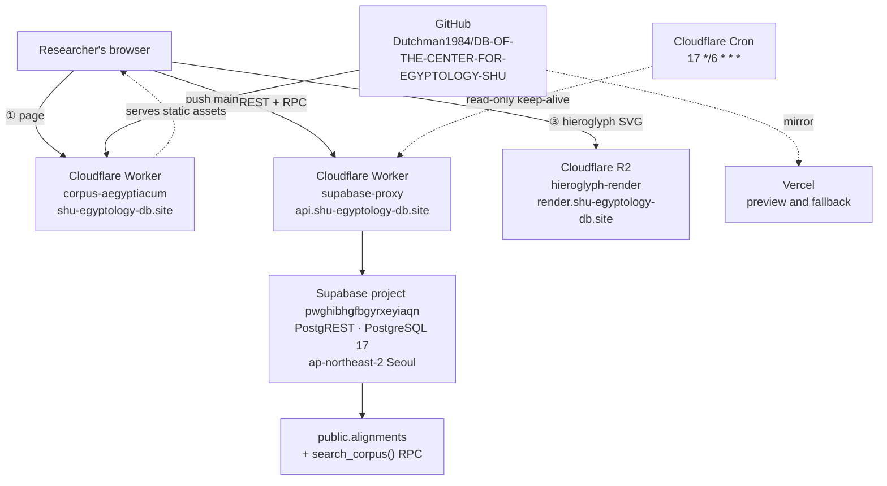

<div align="center">
  
  <h1>Corpus Aegyptiacum · Technical Documentation</h1>
  <h3>Database of the Center for Egyptology, Shanghai University</h3>
  <p>
    Production site · <a href="https://shu-egyptology-db.site">shu-egyptology-db.site</a><br>
    <a href="README.md">中文版 →</a><br>
    <sub>Reflects the architecture after the migration of 2026-09-17</sub>
  </p>
</div>

---

This file is the **technical maintenance reference** for whoever — human developer or AI agent — works on this project next. It describes how the system runs, why it is built this way, and which boundaries must be respected during maintenance. The scholarly scope of the project, the description of the corpus, the feature roadmap, and citation guidance belong to the main project README and the PRD.

---

## Contents

1. [Architecture overview](#1-architecture-overview)
2. [Component inventory](#2-component-inventory)
3. [Frontend](#3-frontend)
4. [Database](#4-database)
5. [Hieroglyph assets](#5-hieroglyph-assets)
6. [Edge layer and keep-alive](#6-edge-layer-and-keep-alive)
7. [Corpus statistics](#7-corpus-statistics)
8. [Change history](#8-change-history)
9. [Incident postmortem: September 2026](#9-incident-postmortem-september-2026)
10. [Maintenance rules](#10-maintenance-rules)
11. [Troubleshooting](#11-troubleshooting)
12. [Local development](#12-local-development)
13. [Repository layout](#13-repository-layout)
14. [Credential inventory](#14-credential-inventory)
15. [Disaster recovery](#15-disaster-recovery)

---

## 1. Architecture overview

The system consists of three mutually independent services, and **the browser is the only integrator**: page code comes from Cloudflare, text data from Supabase, hieroglyphic images from Cloudflare R2. Supabase and R2 never communicate with each other; the only thing linking them is the relative path stored in the database column `render_svg_path`.

This thorough decoupling was the central design decision of the September 2026 migration. Text is small and needs search capability, so it lives in PostgreSQL; hieroglyphic SVGs are bulky and only ever fetched by path, so they live in object storage. Neither side can drag the other down, and replacing either one requires changing a single constant in the frontend.



**Request routing**

| Hostname requested by the browser | Served by | Payload |
|---|---|---|
| `shu-egyptology-db.site` | Cloudflare Worker `corpus-aegyptiacum` | `index.html`, `jsesh.umd.js`, 7,332 glyph SVGs, fonts |
| `api.shu-egyptology-db.site` | Cloudflare Worker `supabase-proxy` | REST / RPC requests forwarded to Supabase |
| `render.shu-egyptology-db.site` | Cloudflare R2 bucket `hieroglyph-render` | 11,466 line-level hieroglyphic SVGs |

All three hostnames sit behind Cloudflare. This gives users in mainland China a single reliable network path and avoids direct browser access to `*.supabase.co`, which is unreliable on some networks.

---

## 2. Component inventory

| Component | Identifier | Configured in | Repository file |
|---|---|---|---|
| Site worker | `corpus-aegyptiacum` | Cloudflare Workers | `worker.mjs` · `wrangler.jsonc` |
| API proxy worker | `supabase-proxy` | Cloudflare dashboard only | **not in this repository** |
| Database project | `pwghibhgfbgyrxeyiaqn` | Supabase (org SHU Egyptology Center, Free plan) | restore script kept externally |
| Object storage | R2 bucket `hieroglyph-render` | Cloudflare R2 (APAC, Standard) | — |
| Frontend application | single-file SPA | — | `index.html` |
| Keep-alive job | Cron `17 */6 * * *` | `wrangler.jsonc` + Worker Secret | `worker.mjs` |
| Mirror deployment | Vercel | Vercel project settings | — |

**Important:** the source of `supabase-proxy` exists only in the Cloudflare dashboard, not in this repository. Its entire logic is to rewrite the request hostname and attach CORS headers; everything hinges on the constant in its first line:

```js
const SUPABASE_HOST = "pwghibhgfbgyrxeyiaqn.supabase.co";
```

When the Supabase project changes, this line **must** be updated as well, or the site keeps pointing at the old project. Bringing this worker under version control is a recommended improvement.

---

## 3. Frontend

### 3.1 Build model

`index.html` is a **single-file React 18 application of roughly 2,200 lines** with no build step: React, ReactDOM, and Babel Standalone are loaded from unpkg via `<script>` tags, and JSX is compiled in the browser at runtime. Anyone can edit the file and deploy it immediately; the cost is in-browser compilation on first load and a runtime dependency on external CDNs.

### 3.2 Runtime configuration

Configuration sits in `index.html` around lines 160–166. All four constants can be overridden through `window.CORPUS_*`, which makes it easy to point a local or test environment at a different backend:

```js
const SUPABASE_URL  = window.CORPUS_SUPABASE_URL || "https://api.shu-egyptology-db.site";
const SUPABASE_KEY  = window.CORPUS_SUPABASE_KEY || "sb_publishable_…";
const HIEROGLYPH_ASSET_BASE = window.CORPUS_HIEROGLYPH_ASSET_BASE
  || "https://render.shu-egyptology-db.site";
const HIEROGLYPH_DIRECTIONS = window.CORPUS_HIEROGLYPH_DIRECTIONS || {};
```

`SUPABASE_KEY` is a **publishable key**. Having it in frontend code is by design; every visitor can read it. Real access control is enforced by the database through RLS policies and grants, see [§4.4](#44-access-control). Secret keys (`sb_secret_…`), `service_role` keys, and database passwords must **never** appear in frontend code.

### 3.3 Data access layer

The frontend does not use `supabase-js`. Instead it ships a lightweight client `sb` of about 40 lines:

- `sb.rpc(fn, params)` — `POST /rest/v1/rpc/{fn}`; currently only `search_corpus` is called;
- `sb.from(table, {select, filters, order, limit, range})` — direct PostgREST queries;
- `fetchAllRows()` — loops with HTTP `Range` headers in pages of 1,000 rows to work around the PostgREST response limit when loading a whole document.

**Only the `apikey` header is sent; `Authorization` is not.** This was a key change during the September 2026 migration: the new publishable keys are not JWTs, and passing one as `Authorization: Bearer` makes the gateway attempt JWT parsing and reject the request with `Invalid JWT`. If a JWT-style key is ever reintroduced the header can come back, but there is no need for it.

### 3.4 UI structure

There are four tabs. **Full-text search** and **document browser** are live; **parallel text** and **text restoration** are placeholders that render `EmptyState` and issue no queries.

The document category tree `DOCUMENT_CATEGORY_TREE` (from around line 560) is a **constant hard-coded in the frontend** that maps `chapter` values into the economic/legal hierarchy and its sub-categories. The database has no category column, so **adding documents requires updating this constant**; otherwise new documents remain searchable but never appear in the browser. This is the coupling most easily overlooked in the current architecture.

### 3.5 Hieroglyph rendering chain

The `HieroglyphView` component renders in this order of preference:

1. **Official SVG** (preferred) — if `render_svg_path` is present, the file is loaded from R2 through an `` tag. Load failures trigger a limited number of retries and **never a downgrade**, so that an unverified rendering is never passed off as a published asset.
2. **In-browser JSesh** (fallback) — used only when no SVG path exists. `jsesh.umd.js` parses `jsesh_mdc` and assembles the line from the 7,332 glyph SVGs under `images/glyphs/`.
3. **Gardiner sequence text** (last resort) — the codes are displayed when neither of the above is available.

The fallback path is preceded by an MdC preprocessing pass (roughly lines 213–300) that strips desktop-only JSesh directives such as `\R270` and converts the space-separated sign groups stored in the database into the hyphenated form JSesh expects. Writing direction comes from the manually reviewed mapping in `hieroglyph-directions.js`.

---

## 4. Database

### 4.1 Project parameters

| Item | Value |
|---|---|
| Project ref | `pwghibhgfbgyrxeyiaqn` |
| Organization | SHU Egyptology Center (Free plan) |
| Region | `ap-northeast-2` (Seoul) |
| Version | PostgreSQL 17 |
| Current size | about 60 MB of a 500 MB limit |
| Extension | `pg_trgm`, installed in the `public` schema |

### 4.2 Fact table

The entire corpus lives in a **single table**, `public.alignments`, with one row per aligned line of an inscription.

| Group | Columns |
|---|---|
| Identity and order | `id` (bigint identity), `source_file`, `physical_line`, `logical_line`, `chapter`, `section` |
| Text layers | `transliteration` (Unicode, used for display), `translation_zh`, `transliteration_ascii` (ASCII-compatible, used for search) |
| Hieroglyphic layers | `search_gardiner`, `jsesh_mdc`, `render_svg_path` |
| Annotation and provenance | `notes` (reader-facing), `provenance` (machine-readable), `annotation_meta` (jsonb array with web numbering, original publication numbering, page numbers) |
| Search layer | `trans_fts` — a generated column, `to_tsvector('simple', transliteration)`, maintained automatically by PostgreSQL |

The constraint `alignments_annotation_meta_array_chk` guarantees that `annotation_meta` is either null or a JSON array.

### 4.3 Indexes and search

```
idx_align_trans_fts          GIN (trans_fts)                        full-text vector
idx_align_trans_trgm         GIN (transliteration gin_trgm_ops)     Unicode transliteration substrings
idx_align_trans_ascii_trgm   GIN (transliteration_ascii …)          ASCII transliteration substrings
idx_align_zh_trgm            GIN (translation_zh …)                 Chinese translation substrings
idx_align_gardiner_trgm      GIN (search_gardiner …)                Gardiner code substrings
idx_align_notes_trgm         GIN (notes …)                          annotation substrings
idx_align_chapter            BTREE (chapter)                        document browsing
idx_align_source             BTREE (source_file, physical_line)     ordering by source
```

All searching goes through one RPC function, `public.search_corpus(query_text text)` (`plpgsql`, `STABLE`). It uses `CROSS JOIN LATERAL (VALUES …)` to match six fields in parallel, then `DISTINCT ON (a.id)` to return each row only once, together with a `match_field` value telling the caller which layer matched (`transliteration_fts` / `transliteration` / `translation_zh` / `search_gardiner` / `notes`). The frontend uses this to label results.

The current implementation is **naive substring matching**: `ILIKE '%query%'`, with no pagination, no ranking, and no boolean syntax. Performance is acceptable at the current scale of roughly ten thousand rows. If the corpus grows substantially, server-side pagination and ranking should come before any further extension of this function.

### 4.4 Access control

```sql
ALTER TABLE public.alignments ENABLE ROW LEVEL SECURITY;
CREATE POLICY allow_public_read   ON public.alignments FOR SELECT USING (true);
CREATE POLICY allow_service_write ON public.alignments TO service_role USING (true) WITH CHECK (true);

GRANT SELECT ON TABLE public.alignments TO anon, authenticated;   -- read-only
GRANT ALL    ON TABLE public.alignments TO service_role;          -- writes
GRANT EXECUTE ON FUNCTION public.search_corpus(text) TO anon, authenticated, service_role;
```

The anonymous role now holds **`SELECT` only**, instead of the previous arrangement where it was granted `ALL` and writes were blocked by RLS alone. This tightening was made during the September 2026 rebuild: even a future RLS misconfiguration would not let anonymous users write. All write operations run server-side or locally using the `service_role` key or the database password.

---

## 5. Hieroglyph assets

### 5.1 Storage parameters

| Item | Value |
|---|---|
| Service | Cloudflare R2 (S3-compatible API) |
| Bucket | `hieroglyph-render` (APAC, Standard storage class) |
| Public domain | `render.shu-egyptology-db.site` (custom domain; `r2.dev` stays disabled) |
| Objects | 11,466, about 1.42 GB |
| Referenced by the database | 11,079, about 1.30 GB |
| Free tier | 10 GB storage, 1M class A operations, 10M class B operations, free egress |

### 5.2 Key scheme and caching

Object keys are **content-addressed**:

```
{economic|legal}/{first 2 hex of hash}/{sha256}.svg
example: legal/6b/6b74e1….svg
```

The database column `render_svg_path` stores exactly this relative path, and the frontend builds the full URL as `HIEROGLYPH_ASSET_BASE + "/" + path`. Lines with identical content naturally share one file; any change in content produces a new path.

Because the path is determined by the content, every object is served with `Cache-Control: public, max-age=31536000, immutable` — cached for a year with no revalidation. **When a rendering is revised, upload a new file and update the database path; never overwrite the existing object**, since long-lived caches in the browser and at the Cloudflare edge would hide the change.

The 387 unreferenced "orphan" objects are superseded renderings retained for traceability. Deleting them would not affect the site.

### 5.3 Adding assets

After rendering new SVGs with JSesh 7.11, keep the same directory structure and upload them with the migration script, which verifies each file's MD5 against the manifest, skips objects that already exist, and can be re-run to resume:

```bash
export R2_ACCOUNT_ID=… R2_ACCESS_KEY_ID=… R2_SECRET_ACCESS_KEY=…
python3 migrate_svg_to_r2.py --bucket hieroglyph-render --src-dir <local render directory>
```

Delete the API token once the upload is finished. When creating it, restrict permissions to **Object Read & Write**, scope it to this bucket only, and set a TTL of a week or less.

---

## 6. Edge layer and keep-alive

### 6.1 Site worker

`worker.mjs` does exactly two things: its `fetch` handler passes every request to `env.ASSETS` (the static asset binding), and its `scheduled` handler runs the keep-alive. In `wrangler.jsonc`, `assets.directory` is set to `.`, meaning the whole repository is the static asset directory, with `.assetsignore` excluding whatever must not be public (`worker.mjs`, `wrangler.jsonc`, `tests/`, local scripts, `.git`, and so on).

**When adding files that should not be publicly served, update `.assetsignore` as well.**

### 6.2 Keep-alive

Projects on the Supabase Free plan are **paused automatically after seven days without activity**. `runKeepAlive()` therefore issues one request every six hours (cron `17 */6 * * *`, i.e. 00:17/06:17/12:17/18:17 UTC):

```
GET api.shu-egyptology-db.site/rest/v1/alignments?select=id&order=id.asc&limit=1
headers: apikey = env.SUPABASE_ANON_KEY
```

It is deliberately written to **fail closed**: a missing secret, a non-200 status, or a payload that is not exactly one array element carrying an `id` each throw an exception. On success it writes a structured `supabase_keepalive_ok` log entry to Cloudflare Observability.

It is **read-only**, holds no write privileges, and performs no DDL or DML.

> ⚠️ **Current gap: failures are written only to Cloudflare logs, with no alerting.** During the September 2026 incident the keep-alive returned 402 for days without anyone noticing. Adding failure notifications (email, webhook, or a chat bot) is the single most valuable operational improvement still outstanding.

### 6.3 Deployment

A push to `main` triggers automatic deployments on both Cloudflare Workers Builds and Vercel. After a release, confirm that a new version appears under the Cloudflare **Deployments** tab and that the production site behaves correctly after a hard refresh (⌘/Ctrl + Shift + R). The Vercel deployment serves as preview and fallback only and is **not the authoritative citation address**.

Worker secrets such as `SUPABASE_ANON_KEY` are stored independently of the code and are not overwritten by deployments; changing one requires clicking **Rotate** in the Cloudflare dashboard and entering the new value.

---

## 7. Corpus statistics

As verified on 2026-09-17 after the migration, against data from the 2026-09-09 backup:

| Metric | Count | Note |
|---|---:|---|
| Aligned lines | 11,126 | rows in `public.alignments` |
| Logical documents | 208 | corpus class + `chapter`; distinct `chapter` values alone: 207 |
| ├ Economic documents | 79 | 7,249 lines |
| └ Legal documents | 129 | 3,877 lines |
| Sections | 733 | `chapter` + `section` combinations |
| Source files | 643 | distinct `source_file` |
| Chinese translations | 11,126 | complete coverage |
| Unicode transliterations | 11,126 | complete coverage |
| ASCII transliterations | 11,126 | complete coverage |
| JSesh MdC | 11,126 | complete coverage |
| Gardiner sequences | 10,974 | 152 lines have no usable sequence |
| SVG paths | 11,126 | pointing to 11,079 unique objects |
| Annotations | 1,352 | `notes` and `annotation_meta` cover the same rows |
| Provenance records | 7,249 | economic documents, stored separately in `provenance` since Round 65 |

SQL for re-checking these figures:

```sql
SELECT count(*), count(DISTINCT chapter), count(DISTINCT (chapter, section)),
       count(DISTINCT source_file), count(*) FILTER (WHERE search_gardiner <> ''),
       count(DISTINCT render_svg_path)
FROM public.alignments;
```

---

## 8. Change history

| Date | Change |
|---|---|
| around 2026-04 | Initial commit: single-file frontend, glyph SVGs, Supabase project `laisqeitaoxlkqratirf` (Seoul) |
| Round 65 | Provenance of economic documents separated from `notes` into its own `provenance` column |
| Round 70 | Badge and interface styling unified |
| **2026-07-06 → 07-16** | 11,466 line-level SVGs uploaded to Supabase Storage in four batches, 1.415 GB in total — **the root cause of the later incident** |
| 2026-07-17 (Round 71) | Cloudflare cron keep-alive added; `compatibility_date` fixed at 2026-07-17 |
| 2026-07-18 (Round 72) | Advanced search V2 merged, then rolled back to the Round 71 state the same day (commit `c1876e0`) |
| 2026-07-24 → 08-24 | First full billing cycle over quota, storage averaging 1.415 GB against a 1 GB allowance |
| after 2026-08-24 | Grace period exhausted, organization restricted, all requests returning 402 |
| 2026-09-09 | Last automatic database backup, later used as the restore source |
| 2026-09-09 → 09-17 | Keep-alive rendered ineffective by the 402 responses; project paused for inactivity and unable to resume while the organization was restricted |
| **2026-09-17** | **Migration completed**: new organization and project, SVGs moved to R2, key replaced with a publishable key, `Authorization` header removed |

The July 2026 dates come from object creation timestamps and Git history. The billing-cycle reconstruction is inferred from the 24th-of-month reset shown in the dashboard; it is a reasonable reconstruction rather than confirmation from Supabase.

---

## 9. Incident postmortem: September 2026

### 9.1 Failure chain

1. The 1.415 GB of hieroglyphic SVGs uploaded in July exceeded the **1 GB** file storage quota of the Supabase Free plan.
2. Storage usage is measured as a **time-weighted average over the billing cycle**. In the July cycle the files existed for only part of the period, so the average was about 0.68 GB and stayed within quota.
3. The cycle from 24 July to 24 August was the first full period over quota, averaging 1.415 GB, which triggered notification and a grace period.
4. Once the grace period was exhausted the organization was restricted and **every API request returned HTTP 402**, so the site displayed zero documents.
5. The keep-alive request received 402 as well. It was most likely rejected at the gateway and never counted as database activity, so the project was paused automatically for inactivity.
6. Attempts to resume the project were refused because the organization was restricted, producing a **deadlock**: files could not be deleted without resuming the project, and the restriction could not be lifted without deleting the files.

The database itself never exceeded its own quota (0.122 GB of 500 MB) and no data was ever lost.

### 9.2 Resolution

The database backup (`.gz`) and the storage archive (`.zip`, 1.42 GB once extracted) were downloaded from the paused project's dashboard page. The system was then rebuilt under a **new organization**: a new Supabase project received the 11,126 rows through a `public`-schema script extracted from the backup; all SVGs were migrated to R2 with per-file MD5 verification; `supabase-proxy` was repointed at the new project; and the frontend key, asset base URL, and request headers were updated. The old project remains paused as an archive and has not been deleted.

### 9.3 Lessons

1. **Storage usage is a level, not a flow.** It does not reset with the billing cycle. Waiting for a reset cannot resolve an overage; only deleting files or upgrading the plan can.
2. **The grace period fires only once.** A second overage brings immediate restriction with no buffer.
3. **A keep-alive cannot defend against quota restrictions.** It only guards against inactivity pauses, and under a restriction it is the first casualty.
4. **Silent failure is the real danger.** The keep-alive wrote failures to logs but raised no alert, which delayed detection by more than a month.
5. **Architecture documentation must be kept current.** The original PRD contained no mention of the layer that stored hieroglyphic SVGs in Supabase Storage, which left early diagnosis without direction. This document exists to correct that.

---

## 10. Maintenance rules

### 10.1 Hard rules

1. **Do not put bulky files back into Supabase Storage.** All hieroglyphic SVGs, images, and PDFs belong in R2. Supabase stores text only.
2. **Only the publishable key belongs in the frontend.** Secret keys (`sb_secret_…`), `service_role` keys, database passwords, and R2 credentials must never enter the repository, frontend code, documentation, or logs.
3. **Do not overwrite existing R2 objects.** With content addressing plus a one-year immutable cache, an overwrite will not take effect; upload a new path and update the database.
4. **Do not write to `trans_fts` directly.** It is a generated column that follows `transliteration` automatically.
5. **Do not "clean up storage" by deleting rows from metadata tables such as `storage.objects` via SQL** — the underlying files are not removed.

### 10.2 Quotas and headroom

| Resource | Limit | Current | Headroom |
|---|---|---|---|
| Supabase database | 500 MB | about 60 MB | ample; several times the current corpus would fit |
| Supabase file storage | 1 GB | 0 | deliberately left empty |
| Supabase egress | 5 GB / month | very low | text only |
| R2 storage | 10 GB | 1.42 GB | ample |
| R2 class B operations | 10M / month | low | images carry a one-year cache |
| Inactivity pause | 7 days | keep-alive every 6 hours | depends on the keep-alive working |

**Check the Supabase Usage page and R2 usage once a month**, and especially after any bulk import.

### 10.3 Full workflow for adding corpus material

1. Connect with the `service_role` key or the database password and insert the new rows into `alignments` — **not** with the frontend key.
2. Render the line-level SVGs with JSesh 7.11 and name them by content hash.
3. Upload them to R2 with `migrate_svg_to_r2.py` and write the relative paths into `render_svg_path`.
4. **Update `DOCUMENT_CATEGORY_TREE` in `index.html`**, otherwise the new documents will not appear in the document browser.
5. Update `hieroglyph-directions.js` if new writing directions are involved.
6. Update [§7 Corpus statistics](#7-corpus-statistics) in this file.
7. Test locally (`node --test tests/keepalive.test.mjs` plus a static-server check) before pushing to `main`.

### 10.4 Rotating keys

When the Supabase publishable key changes, three places must be updated; missing any one breaks the site:

1. the `SUPABASE_KEY` constant in `index.html` (commit and deploy);
2. the `SUPABASE_ANON_KEY` secret of the Cloudflare Worker `corpus-aegyptiacum` (Rotate in the dashboard);
3. any hard-coded value in local scripts or `curl` test commands.

### 10.5 Backups

Backup capability on the Free plan is limited, so **take a manual backup every quarter and after every bulk import**:

```bash
pg_dump "postgresql://postgres.<ref>@aws-0-ap-northeast-2.pooler.supabase.com:5432/postgres" \
  --schema=public --no-owner --no-privileges -f backup_$(date +%Y%m%d).sql
```

A complete local copy of the R2 SVGs already exists (the storage archive zip and its extracted directory). Keep the local originals whenever new assets are produced.

---

## 11. Troubleshooting

| Symptom | Likely cause | What to do |
|---|---|---|
| Site shows zero documents and all counters at 0 | API requests failing: proxy pointing at the wrong project, invalid key, paused project, or restricted organization | Test with `curl "https://api.shu-egyptology-db.site/rest/v1/alignments?select=id&limit=1" -H "apikey: …"` and read the status code |
| `401` or `Invalid JWT` | the publishable key was placed in the `Authorization` header | Confirm that only `apikey` is sent |
| `402` | organization restricted for exceeding a quota | Check the Supabase Usage page and identify the exceeded resource, usually storage |
| `404` or `Origin DNS error` | the project referenced by the proxy is paused, or the ref is mistyped | Check `SUPABASE_HOST` in line 1 of `supabase-proxy` |
| Text renders but hieroglyphs do not | custom domain not active, object missing, or path mismatch | Open one full SVG URL directly in a browser |
| Hieroglyphs appear as assembled glyphs rather than the published rendering | `render_svg_path` is empty for that row, so the JSesh fallback took over | Inspect the path column for that row |
| Code pushed but the site is unchanged | deployment not triggered, or browser cache | Check Cloudflare Deployments; hard refresh with ⌘/Ctrl + Shift + R |
| Keep-alive logs an error | invalid key, paused project, or proxy failure | Read the HTTP status code in the Cloudflare Observability logs |

---

## 12. Local development

The frontend needs no compilation, but it must be served over HTTP and cannot be opened as `file://`:

```bash
./start-local-server.sh        # macOS / Linux (requires python3)
start-local-server.bat         # Windows
# or: npx serve
```

Then open <http://localhost:8080>. By default the local page talks to the production API and R2; to target a different backend, set the `window.CORPUS_*` overrides before `index.html` loads.

Tests (Node.js required):

```bash
node --test tests/keepalive.test.mjs
```

The six existing tests cover the shape of the keep-alive request, a missing secret, HTTP errors, unexpected payloads, `scheduled` registration, and static asset delegation. **Re-run them after any change to `worker.mjs`.** The frontend has no automated tests, so changes there require manually verifying the three main paths: search, browsing, and hieroglyph rendering.

---

## 13. Repository layout

```text
.
├── index.html                   # single-file React 18 application (~2,200 lines)
├── worker.mjs                   # Cloudflare Worker: static assets + keep-alive cron
├── wrangler.jsonc               # worker configuration: routes, cron, asset binding
├── .assetsignore                # files excluded from the public static assets
├── hieroglyph-directions.js     # manually reviewed writing-direction mapping
├── jsesh.umd.js                 # in-browser JSesh fallback rendering engine
├── jsesh-smoke-test.html        # JSesh browser smoke test
├── jsesh-node-smoke-test.js     # JSesh Node.js smoke test
├── start-local-server.sh/.bat   # local static server
├── images/glyphs/               # 7,332 Gardiner glyph SVGs + sizes.js
├── fonts/gentium/               # Gentium transliteration font and its licence
├── logo.png / bg-hieroglyphs.png / favicon.ico / apple-touch-icon.png
└── tests/keepalive.test.mjs     # worker and keep-alive tests
```

**Part of the system but outside this repository:** the `supabase-proxy` worker source, the database schema and data, the 11,466 SVGs in R2, and all credentials.

---

## 14. Credential inventory

This section lists **names and locations only**, never values.

| Credential | Stored in | Nature |
|---|---|---|
| Supabase publishable key | `index.html` + Worker secret `SUPABASE_ANON_KEY` | public, visible in the frontend |
| Supabase secret key | never in the repository; generated when needed | confidential, server-side only |
| Database password | password manager | confidential, used for `psql` imports |
| R2 API token | created temporarily, deleted after use | confidential, scoped to one bucket |
| Cloudflare and Vercel accounts | project lead | confidential |

The anon key of the old project `laisqeitaoxlkqratirf` was invalidated together with that project and needs no further action.

---

## 15. Disaster recovery

To rebuild the entire system from nothing, follow this order — rehearsed end to end in September 2026:

1. **Database** — create a new Supabase project (Seoul, Free plan) and import the `public` schema through the session pooler with `pg_dump` output or the restore script; verify a row count of 11,126.
2. **Assets** — create an R2 bucket and upload from the local copy with `migrate_svg_to_r2.py --src-dir`, which verifies each file's MD5; then attach the custom domain.
3. **Proxy** — edit or recreate the `supabase-proxy` worker with `SUPABASE_HOST` pointing at the new project ref.
4. **Frontend** — update `SUPABASE_KEY` and `HIEROGLYPH_ASSET_BASE` in `index.html` and push to `main`.
5. **Keep-alive** — set the worker secret `SUPABASE_ANON_KEY` and confirm the cron trigger is enabled.
6. **Verification** — test search, document browsing, and hieroglyph rendering in turn, then watch the logs over one keep-alive cycle.

The critical precondition is keeping **two things locally: a logical database backup and the original SVG files**. With both in hand, the whole system can be rebuilt within hours.

---

<div align="center">
  <sub>
    Technical documentation maintained by Zhang Siyuan (<a href="mailto:siyuanzhang@shu.edu.cn">siyuanzhang@shu.edu.cn</a>) · Project lead: Guo Dantong (<a href="mailto:guodantong@shu.edu.cn">guodantong@shu.edu.cn</a>)<br>
    Center for Egyptology, Shanghai University<br>
    Last updated: 2026-09-17
  </sub>
</div>
